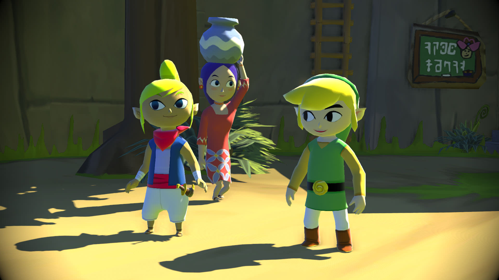
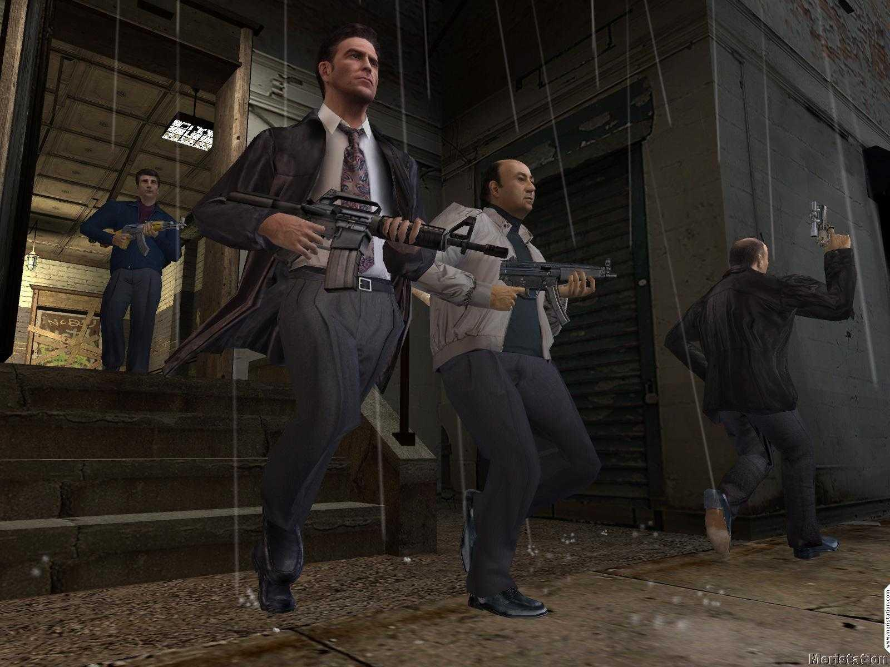

# Análisis individual Gonzalo Pérez 

Lo que pretendo con este tema es hacer reflexionar a los interesados en los videojuegos respecto a que tan necesario es el hiperrealismo en las obras que consumimos. Lo que más han generado ha sido el lanzamiento apresurado de juegos rotos, retrasos exagerados por querer buscar el detalle excesivo en las físicas y texturas que al final no influyen tanto en la jugabilidad (que considero es lo más importante en un videojuego) y estilos visuales que se repiten hasta el hartazgo, en vez de priorizar otros estilos más llamativos que se quedaran con el pasar de los años en la mente de los jugadores. Los gráficos hiperrealistas solo son impresionantes en el momento en que es lanzado el título, a futuro ya son superados por la tecnología, mientras que un estilo artístico único queda grabado para siempre. Como ejemplo, aquí tenemos dos juegos de 2003: The Legend of Zelda: The Wind Waker y Max Payne 2.

No solo es por tema de los visuales, sino que también ayudaría a la industria a invertir de forma menos costosa y así arriesgar menos la seguridad laboral de sus empleados, junto a una mayor posibilidad de juegos más variados en el terreno Triple A. Es difícil lograrlo, considerando que en redes sociales la gente se obsesiona por las físicas realistas y el detalle minucioso de que tanto se puede interactuar con el mundo en un juego, pero eso también es porque se ha mal acostumbrado a la gente, y es tiempo de volver a una mayor sencillez en cuanto a la producción de los juegos, se pueden generar millones sin necesidad de que los pelos de los brazos de los personajes tengan físicas. 

Como ideas, tengo las siguientes: 

1) Contar la historia de los desarrolladores y sus juegos a través de una linea de tiempo, mostrando como ha cambiado la cantidad de títulos y sus tamaños, contrastando aquellas de compañías con menos exclusivos actualmente (como por ejemplo Playstation) con aquellas que han logrado un mejor balance en sus presupuestos y títulos constantes (Nintendo). 

2) Por medio de un formato similar, mostrar como varias empresas se han empeñado últimamente en sacar remakes a montones, mucho más que en el pasado, como una manera de “aliviar” los tiempos de espera entre juegos importantes de sus respectivas franquicias, además de mostrar como las ideas originales pocas veces suelen ser exitosas al triunfar mucho más las secuelas de franquicias preestablecidas o los remakes. En este último caso sería interesante utilizar gráficos que comparen el número de ventas. 

3) Otra idea sería el uso de círculos o algún otro tipo de medición visual que muestre como ha cambiado el peso en GB de los juegos a lo largo del tiempo, junto al número de trabajadores (información que se puede sacar de los créditos de los juegos). 

Aunque el impacto de esta webstory pueda no ser interesante para aquellos quienes manejan las empresas, mi intención es al menos llegar a los fanáticos de este medio interactivo y cuestionarse el necesitar sí o sí de experiencias fotorealistas, buscar otros tipos de juegos y probar cosas independientes, que expandan su paladar jugable. La industria Triple A no es la única que existe, y puede que a futuro tenga más y más problemas para sostenerse a sí misma, ya que por más que se piense lo contrario, en el capitalismo no todo es para siempre. 

## Base de datos 

La principal base que utilizaremos será Backloggd (https://backloggd.com), lugar en que se encuentran registrados casi todos los videojuegos existentes, con información sobre los años de lanzamiento, desarrolladores, publicadores y plataformas en que fueron lanzados, además de datos extras como una breve sinopsis, si es juego completo o DLC, si gano algún premio, entre otros elementos. Uno puede aplicar filtros para encontrar ciertos juegos con variables específicas, o seleccionar una empresa y ver que juegos existen en su catálogo. Nos servira para facilitarnos la tarea de seleccionar los juegos que mostraremos en la página y separarlos según estudio y según año de lanzamiento. La página fue creada por el usuario de reddit “MrProgTheSecond” en 2019. 

 