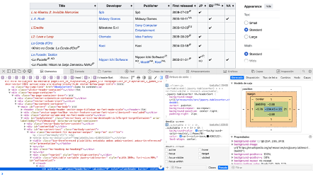

# Entrega Individual – Felipe Guajardo Abarzúa

## Base de datos inicial
La base de datos que propongo es la información proporcionada por Wikipedia, la cual es la fuente principal pero son diversas páginas de Wikipedia, por ende, diferentes tablas. Cada una de estas consiste en todos los juegos publicados por Sony (PS, PS2, PS3, PS4, PS5, PSP y PSVita) y Microsoft (los juegos desarrollados por ellos y posteriormente otras empresas de desarrolladores que crearon para las consolas de aquella marca). 

Entonces las bases de datos están, no hay que crearlas, pero si hay que complementarlas con otras (como lo que propone mi compañero y otras que se mencionaran a continuación) para así poder tener una tabla única con varios datos. Para poder pasar los datos (método de recolección de datos), específicamente las tablas que aparecen en las páginas de Wikipedia, se puede recurrir a la opción de ”Inspeccionar elemento” del navegador y copiar el elemento de la tabla, luego guardarlo en un archivo “.html” y luego abrirlo en un archivo Excel y guardar el documento.

 

La idea es generar una gran tabla que este dividida en secciones o bloques; Nintendo, Sony y Microsoft, y que las columnas sean el título del juego, fecha, desarrollador, ventas e inversión y las filas la información en sí.

Otras fuentes que aportan a la construcción de la propia base de datos son papers que se han publicado acerca de los videojuegos de tipo triple A que son los de; Alhamud, Politowski y un artículo periodístico (Vandal) que fue mencionado en la presentación de la propuesta, específicamente en el punto de antecedentes del tema. Estas fuentes entregan datos, pero además información que complementa la narrativa a trabajar.

El texto de Alhamud va más allá de la rentabilidad de los juegos triple A, sino que lo relaciona con un factor que va de la mano, y es que se prioriza la creatividad de los propios diseñadores en la industria sin llevar a cabo los deseos de la audiencia, y esto se puede relacionar con el poco impacto de los videojuegos a causa de la narrativa generando pocas ventas. El artículo también menciona la monetización de estos productos, pero ligado a la decepción de los gamers. (https://www.diva-portal.org/smash/get/diva2%3A1769625/FULLTEXT01.pdf) 
 
Por otra parte, el texto de Politowski establece que los grandes desarrolladores trabajan con un sistema de código cerrado lo cual implica en un desconocimiento sobre los problemas que se tiene al realizar un videojuego. Esto no solo contempla problemas gráficos como bugs y ese tipo de problemas recurrentes, sino que también problemas administrativos y económicos como lo son las ventas, marketing, negocios y distribución. Por lo que toda esta información puede aportar y ser relevante para el webstory (https://arxiv.org/abs/2009.02440). 
 

## Las bases de datos encontradas Wikipedia son las siguientes:
•	Microsoft: 
https://en.wikipedia.org/wiki/List_of_Microsoft_Gaming_video_games? 

https://en.wikipedia.org/wiki/List_of_Microsoft_video_games? 

https://en.wikipedia.org/wiki/List_of_Microsoft_games:_1979–2000 

https://en.wikipedia.org/wiki/List_of_Xbox_Game_Studios_video_games 

https://en.wikipedia.org/wiki/List_of_Bethesda_Softworks_video_games 

https://en.wikipedia.org/wiki/List_of_Activision_video_games 

https://en.wikipedia.org/wiki/List_of_Blizzard_Entertainment_games 
  
  
•	Sony PS: 
https://en.wikipedia.org/wiki/List_of_PlayStation_(console)_games_(A–L) 

https://en.wikipedia.org/wiki/List_of_PlayStation_(console)_games_(M–Z) 

https://en.wikipedia.org/wiki/List_of_best-selling_PlayStation_video_games 
  
o	Sony PS2: 
https://en.wikipedia.org/wiki/List_of_PlayStation_2_games_(A–K) 

https://en.wikipedia.org/wiki/List_of_PlayStation_2_games_(L–Z) 

https://en.wikipedia.org/wiki/List_of_best-selling_PlayStation_2_video_games 
  
o	Sony PSP: 
https://en.wikipedia.org/wiki/List_of_PlayStation_Portable_games 

https://en.wikipedia.org/wiki/List_of_best-selling_PSP_video_games 
  
o	Sony PS3: 
https://en.wikipedia.org/wiki/List_of_PlayStation_3_games_(A–C) 

https://en.wikipedia.org/wiki/List_of_PlayStation_3_games_(D–I) 

https://en.wikipedia.org/wiki/List_of_PlayStation_3_games_(J–P) 

https://en.wikipedia.org/wiki/List_of_PlayStation_3_games_(Q–Z) 
  
o	Sony PSVita: 
https://en.wikipedia.org/wiki/List_of_PlayStation_Vita_games_(A–D) 

https://en.wikipedia.org/wiki/List_of_PlayStation_Vita_games_(E–H) 

https://en.wikipedia.org/wiki/List_of_PlayStation_Vita_games_(I–L) 

https://en.wikipedia.org/wiki/List_of_PlayStation_Vita_games_(M–O) 

https://en.wikipedia.org/wiki/List_of_PlayStation_Vita_games_(P–R) 

https://en.wikipedia.org/wiki/List_of_PlayStation_Vita_games_(S) 

https://en.wikipedia.org/wiki/List_of_PlayStation_Vita_games_(T–V) 

https://en.wikipedia.org/wiki/List_of_PlayStation_Vita_games_(W–Z) 
  

o	Sony PS4: 
https://en.wikipedia.org/wiki/List_of_PlayStation_4_games_(A–L) 

https://en.wikipedia.org/wiki/List_of_PlayStation_4_games_(M–Z) 

https://en.wikipedia.org/wiki/List_of_best-selling_PlayStation_4_video_games 
  

o	Sony PS5: 

https://en.wikipedia.org/wiki/List_of_PlayStation_5_games 

## Ficha de información (datos de Wikipedia)
•	Autor y publicación de los datos: 
La información es propiedad de Wikipedia, pero funciona a través de un trabajo colaborativo y es el resultado de diversas fuentes (los links ya fueron mencionados).

•	Contenido: 
Las tablas tienen información como títulos, desarrolladores, fechas, género, categorías, entre otros. Respecto a los datos, son de terceros y si bien se desconoce el periodo en que se levantaron (porque tienen diversas fuentes) siempre se están actualizando.

•	Pertinencia: 
La base de datos es valiosa porque logra recopilar bastante información a partir de diversas fuentes de información, por lo que se logra unir toda esa información en un solo lugar y sirve porque aporta. Aporta datos que se desconocen como los mismos títulos de videojuegos ya que son muchos.

•	Metodología: 
Como ya se mencionó, se espera poder inspeccionar los elementos de las páginas y transformarlos a un archivo “.html”. 

## Análisis crítico individual
Espero que se pueda contar cómo es que la industria de juegos de carácter triple A ya no está siendo sostenible en la actualidad y que eventualmente ocurriría un colapso en la misma industria. Espero contar una narrativa que sea bastante interactiva, que la página tenga gráficas que a la hora de ir scrolleando sea mueva, que sea mucho más dinámico que un gráfico de barras, y que el diseño sea algo muy relevante para que no parezca una simple página, pero eso no quita que la información pase a un segundo plano, la información debe ser bastante sólida también.

En cuanto al impacto, espero que sea alto, tal vez no sea un gran descubrimiento, pero creo que la forma en que se va a contar o narrar será bastante novedosa. Pero además ese impacto espero que sea alto porque no solo se trata de demostrar el impacto económico de estas grandes empresas, sino buscar correlaciones como por ejemplo el porqué de las cosas, como por ejemplo ¿por qué el éxito no es tan grande?, entonces eso va más ligado con las expectativas de los seguidores, y por otra parte esta lo que pasa con los mismos diseñadores. Así también, se podría esperar revelar lo que sería el qué pasa a nivel administrativo en estas empresas de desarrollo, el qué pasa con los despidos de los trabajadores, por qué se hacen estos despidos, y ver si está ligado con la insostenibilidad del modelo de estos juegos, y el desafío es poder contarlo con datos.

Sobre las ideas que me gustaría realizar para contar la historia es poder transformar la tabla de datos en gráfica, poder hacer un gráfico que sea dinámico, que se mueva a la medida de ir scrolleando para no caer en algo simple y poco atractivo.

Otra idea, es poder establecer correlaciones entre variables o datos, y que esos datos también se grafiquen, pero más allá de como un gráfico aparte, que interactúe con los otros gráficos. Pero que además de gráficos, debe haber bastante información escrita, y que los gráficos estén al medio de cada página.

En cuanto a diseño, es que tal vez el cursos se pueda a editar de acuerdo a la pestaña del menú (ese menú que incluya secciones como Nintendo, Sony, Microsoft, conclusiones y referencias), como por ejemplo si se está en la pestaña de “Nintendo”, que el cursos tenga una forma de guante blanco.

También se puede generar una pestaña que sea de anexos, más allá de dejar un espacio de referencias como fuentes, crear un espacio de anexos donde se encuentren diversos artículos como los que se mencionaron que abordan temas relacionados o complementarios.

