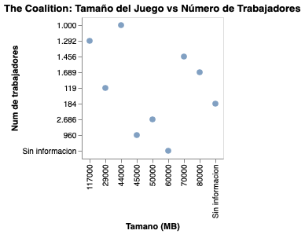

# Videojuegos de The Coalition ; un aumento de 36,3% en cuanto al tamaño de los videojuegos, y descensos en la cantidad de desarrolladores.

*Los videojuegos de categoría Triple A de la compañía The Coaltion cada vez pesan más, mientras que la cantidad de trabajadores que son desarrolladores son menos. Si bien esto no es algo perfectamente lineal, se pueden identificar ciertas tendencias que indican un problema en el desarrollo de este tipo de videojuegos. Hay estudios que identifican que el aumento del tamaño de los videojuegos se debe al  perfeccionamiento de gráficas y de programación lo cual también incide en los despidos de los desarrolladores.*

-----------------------------------------------------------------

The Coalition es una de las trece compañías de desarrollo de videojuegos de Xbox Game Studios, constituyendo a una compañía que desarrolla juegos de tipo Triple A. Esta compañía destaca por sus juegos de la serie Gears o Gears of Wars, y el primer lanzamiento de esta compañía fue el año 2015 con Gears of War Ultimate Edition, mientras que el último juego tiene fecha de publicación para el próximo año. Sus juegos han sido desarrollados para Xbox y otras consolas, y desde el 2015 hasta la actualidad suman 9 títulos.

Al ser videojuegos de tipo Triple A, en cuanto a estos, en algunos informes y sobre todo fanáticos comentan que se acerca una crisis sobre el desarrollo de estos productos. Dentro de estas características, se menciona que los videojuegos cada vez son más pesados debido a que cada vez se busca una mejor resolución, una mayor perfección y una mejor programación y desarrollo. En este caso, esto se puede evidenciar el incremento de sus títulos en cuanto al tamaño de estos (en MB), ya que el primer título del año 2015 solo pesa 44.000 MB (44GB), mientras que el título del año 2026 se conoce que pesa 66.000 MB (66GB), lo cual demuestra una variación porcentual / aumento de un 36,3%.

Esto no solo ha sido lo único que ha incrementado. Inicialmente la cantidad de trabajadores que han aportado en el desarrollo de videojuegos aumentó un 168% si se compara el primer título con el del 2021 que es Halo Infinite, es decir, se pasó de 1.000 desarrolladores a 2.686. Pero, de acuerdo a otras investigaciones, otra característica de esta crisis de los videojuegos Triple A, es que los compañías enfrentan una crisis con los mismos desarrolladores por exigencias, traduciéndose en despidos. Luego de ese gran aumento del 2021, ha habido un descenso, lo cual se evidencia con las cifras de Gears of War Realoded (2025) el cual estuvo compuesto por tan solo 1.456 desarrolladores, traduciéndose en un descenso de un 45,7%, lo cual puede ir de la mano con aquel conflicto.

Lo anterior se puede observar en la siguiente gráfica que considera la cantidad de trabajadores de la compañía The Coalition en cada entrega, así como también el peso del respectivo videojuego.

