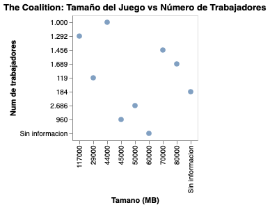

# Explicación construcción de la visualización 

Antes de comenzar con la base de datos en Google Colab, se consideraron las correcciones de la entrega numero 2; por ende, se convirtió toda la columna del tamaño de juegos, donde algunos estaban en MB, otros en GB y uno en KB, por ende, se transformaron todos a MB. Así también, se eliminaron todos los caracteres especiales como las "ñ", letras con tílde y de otro tipo para evitar errores a la hora de que se procesen los datos. El otro cambio que se realizo fue respecto a las plataformas de los videojuegos para evitar demasiada información acumulada en las celdas, por lo que se crearon tres columnas para identificar si esos juegos estaban disponibles a tal plataforma, donde la información responde a "Si" o "No" (Si/No esta disponible).

Una vez hecho eso, analice la base de datos para poder identificar qué es lo que realmente queria visualizar, ya que imposible visualizar todo y que a la vez sea coherente. Decidi trabajar específicamente con los juegos de la compañia The Coalition, porque sus trabajos han sido mucho más continuos y no son tantos títulos asi como tampoco demasiado pocos, por lo que creo que es preciso. Así tambien, la escogi porque en cierto grado representa una correlación directa en cuanto el numero de trabajadores y el peso del videojuego, es decir, mientras más trabajadores hay, más pesado es el juego (ya se vera que esto no es como una regla principal, en general ocurre esto, pero no en todos los casos).

## Proceso de programación

En primer lugar, se subió/importó a la plataforma la base de datos a Google Colab. Luego seguí los mismos pasos que hemos realizado en clases que es que "corra" la base, que se pueda leer copiando la ruta del documento.

Luego, como no quiero usar todos los datos de la BD, repeti lo de importar en altair, repeti las mismas lineas inciales, pero en lugar de copiar la ruta de acceso (porque eso ya esta hecho), toco filtrar la base de datos (que es source). Entonces cree nuevos valores que es el source_filtrado, donde inicialmente puse que la compañia con la que quiero trabajar es The Coalition, pero eso no es suficiente, porque su lo dejaba así se iban a imprimir columnas que no vienen al caso, por ende, agrego otro filtro que es el del videojuego, el tamaño y el numero de trabajadores. Luego de eso puse print para asegurarme de que todo estuviera bien.

En cuanto a la forma de graficar, aqui fue mucho más dificil porque como queria mostrar la relación entre el tamaño del juego y la cantidad de trabajadores, sentia que era más apropiado usar este grafico: 

 17.07.58.png>)

En lugar de cuatro gráficos serían dos, por mis variables (tamano y trabajadores), pero no logre que aparecieran los titulos de los juegos, solo se completaba un grafico y era una especie de pila, como un bloque de color, por ende, no graficaba de buena forma.

Viendo otros ejemplos, decidi trabajar con algo sencillo que es el resultado de mi trabajo de visualización; el resultado es este gráfico de dispersión, donde fue reemplazando los valores:

Trate de hacer modificaciones para que los valores numericos estuvieran en las lineas de manera creciente, de menor a mayor, y a pesar de buscar en internet, no lo logré. Pero eso no quita el funcionamiento del grafico, asi como la información en las viñetas.

## Preguntas posibles que se pueden responder:
¿Cuántos trabajadores contribuyeron al juegos de mayor tamaño de The Coalition?

¿Hay alguna tendencia en cuanto al aumento del tamaño del juego con la cantidad de trabajadores?

Si no es así, ¿que juegos demuestran lo contrario?

Si es así, ¿qué juegos demuestran aquello?

A simple vista, ¿A qué se debe la dispersión del gráfico?

